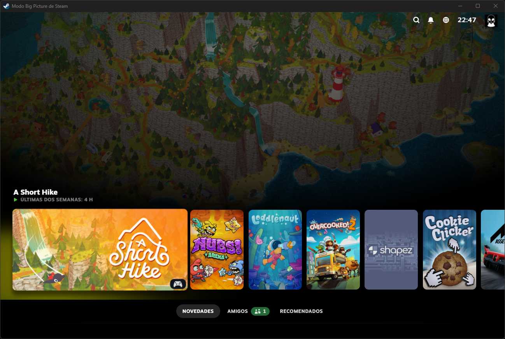
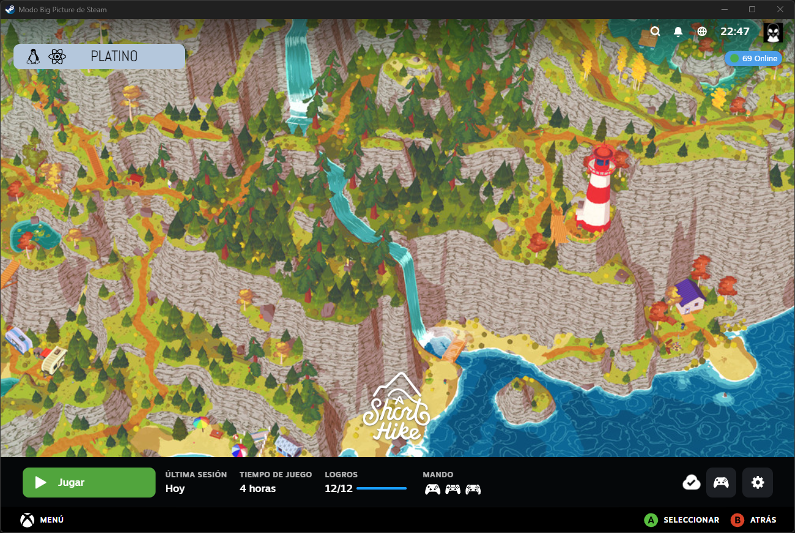

# Steam Deck Theme CSS Loader 🎨

This "Steam Deck / Steam big picture" theme is designed to be used with the **CSS Loader** plugin, part of the **Decky Loader** ecosystem.

## 🖼️ Previews

## 🚀 Installation

1.  Make sure you have [Decky Loader](https://github.com/SteamDeckHomebrew/decky-loader) installed on your Steam Deck.
2.  Install the [CSS Loader](https://github.com/DeckThemes/SDH-CssLoader) plugin from the Decky PluginStore.
3.  Download this theme (or clone this repository).
4.  Place the theme folder into the `homebrew/themes` directory.
5.  Open CSS Loader in Decky, find this theme, and enable it!

## 📄 License

This project is licensed under the [MIT License](LICENSE).